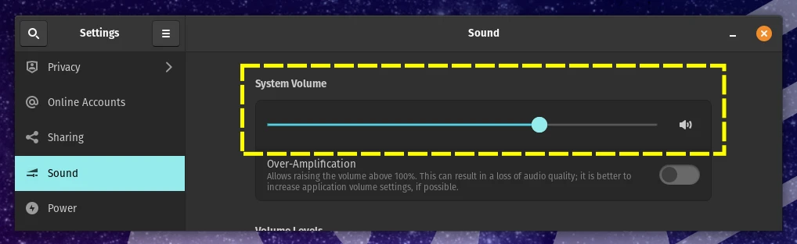
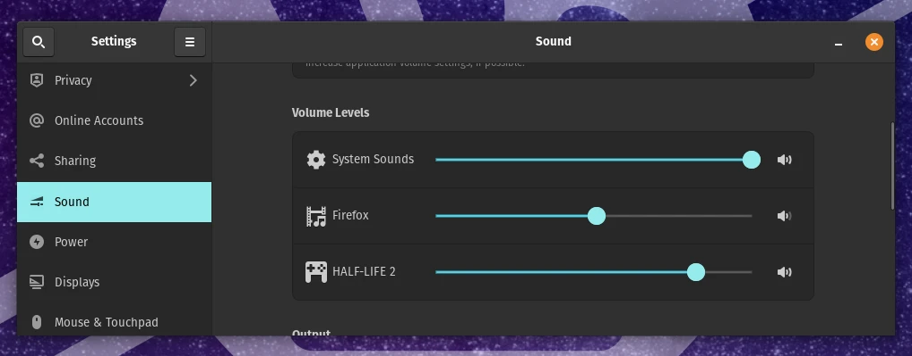

# Speaker & Audio Settings

The system sound settings located in `Settings` ➞ `Sound` allow the selection and configuration of audio input and output devices.

---

## System Volume

The `System Volume` slider controls the overall output volume for all applications.

Clicking the speaker icon on the right side of the slider will toggle the volume to 0%; clicking the icon again will toggle the volume back to what it was previously set to, or dragging the volume back up will automatically un-toggle the icon.

### Over-Amplification

The `Over-Amplification` feature allows you to raise the volume over 100% by digitally boosting the output signal. This can be useful if your speakers or headphones are too quiet.

The `100%` marker on the volume slider shows what would have been the maximum volume if `Over-Amplification` was not enabled. Audio may become distored when the volume is raised above this level.

## Per-Application Volume

The volume level for each individual application can be adjusted separately using the sliders under the `Volume Levels` section. Note that only running applications will appear in the list, and some applications will only appear when actively playing audio.

Sometimes, you may see more than one entry show up for the same application, or you may see entries show up that don't correspond to specific application names. In those cases, you can try adjusting the different entries until you find the one you're looking for.

## Output Device Selection

The `Output Device` drop-down selects which device will be used for sound output by default.

>**Note:** A computer's sound card might only allow one of its outputs to be available at a time. For example, many laptops cannot output to their loudspeakers if headphones are plugged in.

The volume meter underneath the drop-down will show if the computer is sending any audio to the output device. If the meter is lighting up but you don't hear any sound, you may need to perform troubleshooting on physical aspects such as the speaker power or cabling.

<video autoplay loop>
    <source src="./img/output-sound-meter.webm" />
</video>

The `Balance` setting underneath the output device can make one side of the audio louder than the other; this can be useful if you're using physical speakers and one is farther away than the other.

---

## Input Device Selection

The `Input Device` drop-down selects which device will be used for sound input by default. Applications may be able to select other input devices manually.

Again, you may notice some devices that show up multiple times in the list. You can try each entry until you find one that works.

## Input Device Volume

The `Volume` slider under the `Input` section allows adjusting the microphone sensitivity. The volume should be adjusted so sound is visible but does not reach the right side of the activity bar.

<video autoplay loop>
    <source src="./img/input-volume.webm" />
</video>
